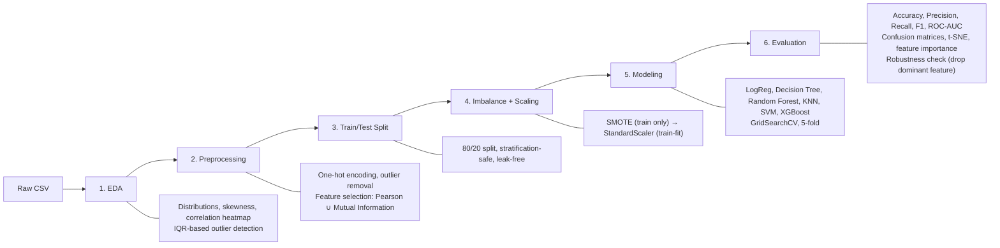
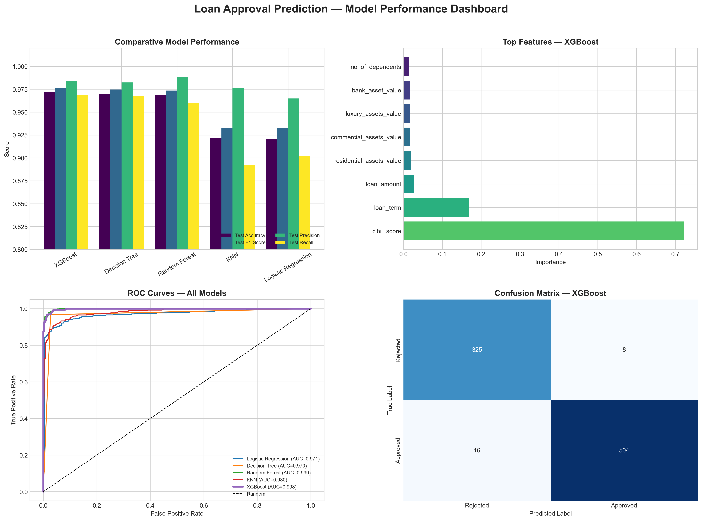

# ⚖️ ML Credit Risk Pipeline

**Loan Approval Prediction** — an end-to-end machine learning pipeline that
benchmarks classical and boosted-ensemble models on real credit-risk
decisioning, from raw applicant data through a production-style model
comparison and robustness audit.

---

## 🎯 Problem Statement & Dataset Overview

Financial institutions need to decide, quickly and consistently, whether a
loan application should be **approved** or **rejected**. This project builds
and rigorously compares six classification models on that exact task, using
applicant financial, credit, asset, and demographic data.

**Dataset:** `loan_approval.csv` — tabular loan-application records with:

| Category | Features |
|---|---|
| Credit | `cibil_score` |
| Income & loan terms | `income_annum`, `loan_amount`, `loan_term` |
| Assets | `residential_assets_value`, `commercial_assets_value`, `luxury_assets_value`, `bank_asset_value` |
| Demographic | `no_of_dependents`, `education`, `self_employed` |
| **Target** | `loan_status` (Approved / Rejected) |

The target is moderately imbalanced toward approvals, which shapes several
downstream decisions — resampling strategy, metric choice (F1/AUC over raw
Accuracy), and evaluation depth.

---

## 🏗 Pipeline Overview

1. **EDA** – distributions, skewness, correlation heatmap, IQR outlier detection  
2. **Preprocessing** – one‑hot encoding, outlier removal, feature selection (Pearson + MI)  
3. **Train/Test Split** – 80/20, stratification‑safe, no data leakage  
4. **Imbalance + Scaling** – SMOTE (train only) → StandardScaler (fit on train)  
5. **Modeling** – LogReg, Decision Tree, Random Forest, KNN, SVM, XGBoost (GridSearchCV, 5‑fold)  
6. **Evaluation** – Accuracy, Precision, Recall, F1, ROC‑AUC; confusion matrices, t‑SNE, feature importance, robustness check

 

---

## 📊 Key Results & Highlights

Six models were tuned via 5-fold `GridSearchCV` (F1-scored) and evaluated on
a held-out test set:

| Model | Test Accuracy | Test F1 | Test Precision |
|---|---|---|---|
| 🏆 **XGBoost** | **0.9777** | **0.9816** | **0.9902** |
| Random Forest | 0.9683 | 0.9755 | 0.9881 |
| Decision Tree | 0.9695 | 0.9748 | 0.9721 |
| SVM (RBF) | 0.9414 | 0.9512 | 0.9663 |
| KNN | 0.9215 | 0.9327 | 0.9768 |
| Logistic Regression | 0.9203 | 0.9324 | 0.9650 |

 

**Interpretation.**
- **XGBoost is the clear winner** across every headline metric, with CV and
  test scores nearly identical — strong evidence of genuine generalization
  rather than overfitting to the training folds.
- **`cibil_score` (credit score) dominates feature importance** across all
  tree-based models, confirming what the correlation and mutual-information
  analysis in the notebook already showed. A dedicated robustness check
  (dropping this feature and retraining) quantifies exactly how load-bearing
  it is — see the notebook, Section 5.7.
- **No model shows meaningful overfitting** — CV F1 and Test F1 track
  closely for every candidate, which is atypical for a from-scratch student
  pipeline and speaks to a disciplined leak-free split → resample → scale →
  tune workflow.
- Linear and distance-based models (Logistic Regression, KNN) sit closest to
  the random-classifier baseline on the Precision–Recall plot — the true
  decision boundary in this dataset is non-linear, which the tree/ensemble
  models exploit and the linear models cannot.

---

## 🔑 Key Takeaways

- **Best model:** XGBoost — 97.8% test accuracy, 0.982 F1, 0.990 precision.
- **Primary risk driver:** `cibil_score`, overwhelmingly — a strength for
  accuracy, but a fragility for real-world robustness (see the notebook's
  drop-feature audit).
  
**Project Scope:** This is a straightforward machine learning project designed to explore and benchmark various techniques and models. The primary goal is to study different ML workflows, preprocessing methods, and model evaluation strategies using a relatively simple dataset.

